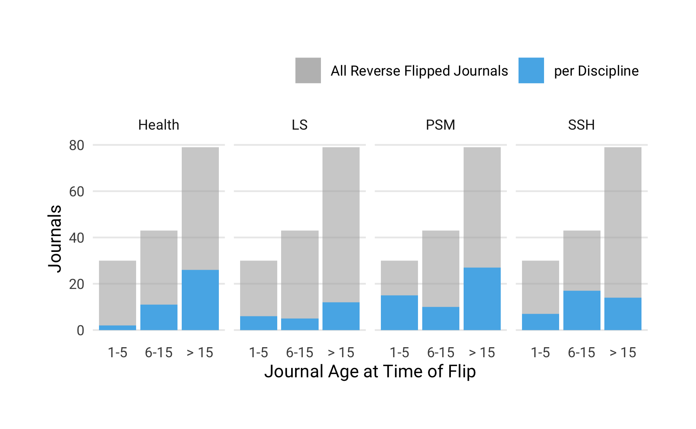

### Research question 1: How many OA journals have reverse-flipped to a subscription model? 
 
We identified 152 journals that converted from fully open access to a subscription model, including hybrid open access. While we discovered reverse-flips as early as 2005, the majority of journals 2005. While the earliest reverse flip happened in 2005, the majority of journals changed their business model from 2013 onward (see Figure 3).


### Research Question 2: To provide a general overview,

#### a) How thoroughly are these journals currently indexed in major bibliometric databases (Web of Science, Scopus, PubMed)?
 
We investigated the coverage of reverse-flip journals in the following four major bibliographic databases: i) Crossref, a large DOI registration agency for scholarly works, ii) Scopus, iii) Journal Citation Report (JCR) listing journals indexed for the Web of Science, and iv) journals indexed in MEDLINE. This analysis is based at the journal-level by matching ISSN variants. We used the most current journal lists and search indexes from January 2019. 


In total, we found 147 being indexed by at least one bibliometric databases examined, covering 97% of the journals in our study. Figure presents the number of reverse-flip journals that are indexed by each database and the intersection with other databases. 
Of the ` r index_df %>% distinct(issn) %>% nrow()` indexed journals, Crossref and Scopus are the most frequent sources which cover reverse-flip journals. Together with the Web of Science (JCR) they share the largest number of journals (N = 83), of which 26 journals are also covered by MEDLINE.


<!-- -->

### Research Question 2: How many articles did these journals publish between 2000 and 2018?


To obtain the journal publication volume, we retrieved all articles indexed in Crossref from 2000 onward. Articles metadata from 136 journals were registered with Crossref, representing 89% of our sample. These journals published 190,681 articles between 2000 and 2018. Table presents summary statistics for the average yearly publication volume. Figure presents the average yearly journal volume. They show that the size of the journals in terms of the yearly article volume varies considerably, ranging from 10 to 638. Half of the journals studied published 57 or less articles per year. 


Table: Summary statistics of yearly average publication volume per reverse flip journals. Publication volume for 142 journals was obtained using Crossref.

                      Average Yearly Article Volume
-------------------  ------------------------------
Mean                                             98
Median                                           57
Standard Deviation                              116
Minimum                                          10
Maximum                                         638
Q1                                               30
Q3                                              111


### Research Question 3: What is the disciplinary distribution of these journals? 


Table presents a breakdown by top-level discipline, highlighting that reverse flipped journal could be found in various fields (needs to be discussed).


Table: Breakdown of reverse flip journals by discipline

Discipline    Number of Journals   Proportion (in%)
-----------  -------------------  -----------------
PSM                           52                 34
Health                        39                 26
SSH                           38                 25
LS                            23                 15
Total                        152                100


### Research Question 4: How old were the journals when the reverse flips happened?

Table provides summary statistics about the journal age at the year of the reverse flip. Large age differences can be observed, ranging from one year of existences to 124 years. Around 43% (N = 66) of all journals found started before 1990. These findings suggest that not all journals in our sample were born fully open access or online journals, but some might underwent more than one business model change in the course of history.


Table: Summary statistics for journal age at time of reverse flip

                      Journal Age in Years
-------------------  ---------------------
Mean                                    25
Median                                  16
Standard Deviation                      22
Minimum                                  1
Maximum                                124
Q1                                       7
Q3                                      39

Figure presents the number of journals converted from fully open access to a subscription-based business model per year grouped by journal age when the reverse flip happened.


Figure presents a breakdown of discipline by journal age at the time of the reverse flip, shown as proportion of the total number of reverse flip journals in the dataset. The colored areas represent the distribution of journals per discipline. 


It seems that for health and life sciences journals (Health) the majority of flips only happened after a period of establishing the journal (>15 years). However, for the physical sciences and mathematics (PSM) as well as the social sciences and humanities (SSH) this process of reconsidering the publishing model seems to have started earlier. For PSM journals about one third already flipped within the first five years of the journal’s lifetime. Overall, this may have resulted from a somewhat lower degree of acceptance of APC-based open access in these disciplines (add REF)

### Research Question 5: What publishers are now publishing the reverse-flipped journals?


To investigate the extent of reverse flips across publishers, publisher names for every journal were obtained using Crossref, and if not available, added manually. In case of a change of publishing house, which is the case for over 74% (N = 112) journals in our sample, the current publisher name was used. In total, 44 different publishing houses with reversely flipped journals are included in our dataset. 

Table shows the top 5 publishers based on the number of journals in their subscription-based portfolio that were converted from fully open access. These five publishers comprise a total 103 journals, representing 68% of all journals found. The remaining 38 publishers are represented in the category "Other". The extent of reverse flips across publishers reflects roughly the general market shares in scholarly publishing  where the large commercial publishers Elsevier BV, Springer Nature, Informa UK Limited and Wiley also dominate.


Table: Top 5 publishers based on number of journals converted from from fully open access to a subscription-based business model

Publisher                 Number of reverse-flipped journals   Proportion (in%)
-----------------------  -----------------------------------  -----------------
Springer Nature                                           41               27.0
Elsevier BV                                               34               22.4
Informa UK Limited                                        13                8.6
Walter de Gruyter GmbH                                     7                4.6
Brill                                                      4                2.6
Wiley                                                      4                2.6
Other                                                     49               32.2
Total                                                    152              100.0

### Research Question 6: How many of these journals a) had been subscription journals in the past, b) had been APC-based prior to the reverse-flip, and at what price levels, c) are associated with scholarly societies?

We manually checked the past business models of every journal in our sample. As the journal age suggests, not all were born digital and underwent several business changes. In total, around 62% had been subscription-based in the past. 

<!-- -->

(unsure about how to answer this question using our dataset, help is very much appreciated!)

### Research Question 7:  Is there significant variation in  a) publication volume before and after the reverse flip and b) journal-level citation metrics before and after the reverse flip?


 To determine the variation in publication volume, we studied all journals that had converted until 2016 and for which Crossref provides article metadata two years before and after the reverse flip. We were able to obtain the publication volume of 94 journals for this five-year period.
 
Comparing the yearly article volumes over the period from two years before to two years after the flip reveals little change. The median article volume  increased marginally from 53 to 62 articles. Figure illustrates the distribution before and after the flip.


There are, however, some cases were article volume increased noticeably. One example is the journal *Meta Gene* launched by Elsevier BV in 2013. Its article volume grew from 86 articles published in the year of the reverse flip (2016) to 201 articles published two years after (2018).


To investigate whether the citation impact changed after the journal converted to a toll-access business model, we used the Source Normalized Impact per Paper (SNIP) indicator from the Centre for Science and Technology Studies (CWTS) at Leiden University, matching 117 journals from our sample.
Figure illustrates the SNIP distribution of reverse-flip journals two years before and after the conversion. The most recent SNIP values were reported for 2017; accordingly, we only included journals that flipped until 2015 (N = 82). Our analysis suggests that there is no statistical difference in SNIP values before and after the business model change.


### Research Question 8: For the subset of journals that now offer hybrid OA, a) what is the difference in the APC before and after the flip among the journals, b) what is the uptake of hybrid OA in these journals, is it above average among hybrid OA journals? 

Table presents the journal business model after the reverse flip. Our analysis shows that around 50 % (N = 76) of the journals offer options to make articles immediately available after a fee was paid, also known as hybrid open access. 76  or 50 % (N = 76) journals operated under a subscription-based model only.


Table: Business model of journals after reverse flip

Business model    Journals   Proportion
---------------  ---------  -----------
Hybrid                  76           50
Subscription            76           50
Total                  152          100


We were able to obtain publication fee list prices before and after the flip including the most recent level in 2018 for 30 journals. Figure compares them with each other, highlighting an considerable increase after the reverse flip.


Retrieving open content licenses including start date from Crossref, we were able to obtain 416 articles from 21 that were made available immediately as open access articles in the year or after the reverse flip. They represent 5.4% of the total article volume studied.

Using data from the Open APC initiative, we finally checked whether institutions have financed hybrid open access articles in reverse-flipped journals. We found evidence for institutional sponsorship for three individual articles in reverse-flip journals, and as part of a transformative agreement "Springer Compact" offered by Springer Nature to individual institutions and countries. Table summaries the total number of articles in reverse-flip journal that were made openly available under "Springer Compact" agreements, as well as its proportion per transformation contract. Although the proportion these articles is marginally, findings suggest that mechanisms were missing that would have helped institutions to prevent funding of open access publication in reverse-flipped journals.


hybrid_type             publisher.x       Sponsor           OA Articles in Reverse Flip Journals   All OA Articles   Proportion (in%)
----------------------  ----------------  ---------------  -------------------------------------  ----------------  -----------------
Open APC (Offsetting)   Springer Nature   United Kingdom                                      20             10289               0.19
Open APC (Offsetting)   Springer Nature   Sweden                                              10              3285               0.30
Open APC (Offsetting)   Springer Nature   Austria                                              5              1721               0.29
Open APC (Offsetting)   Springer Nature   Germany                                              3               621               0.48
Open APC (Offsetting)   Springer Nature   Netherlands                                          2              6085               0.03


```
#> # A tibble: 21 x 4
#>    journal_title                                     jn_volume   hoa  prop
#>    <chr>                                                 <int> <int> <dbl>
#>  1 3 Biotech                                               895    60  6.7 
#>  2 Acta Geophysica                                         232    46 19.8 
#>  3 Annals of Nuclear Medicine                              273    53 19.4 
#>  4 Applied Nanoscience                                     292    11  3.77
#>  5 Arabian Journal for Science and Engineering            2124    12  0.56
#>  6 Brazilian Journal of Physics                             85     1  1.18
#>  7 Cancer Treatment Communications                          34     1  2.94
#>  8 Computational and Applied Mathematics                   462    11  2.38
#>  9 Gold Bulletin                                            41     2  4.88
#> 10 Integrating Materials and Manufacturing Innovati…        41     4  9.76
#> # ... with 11 more rows
```


