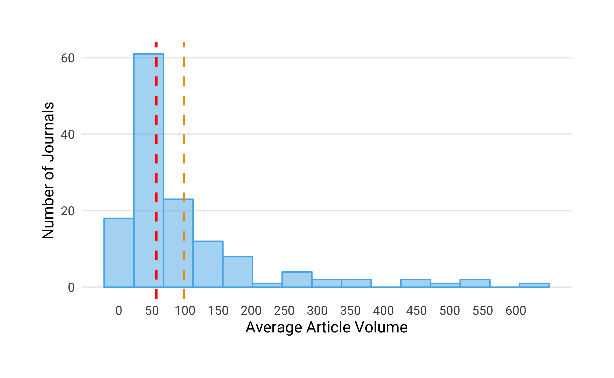
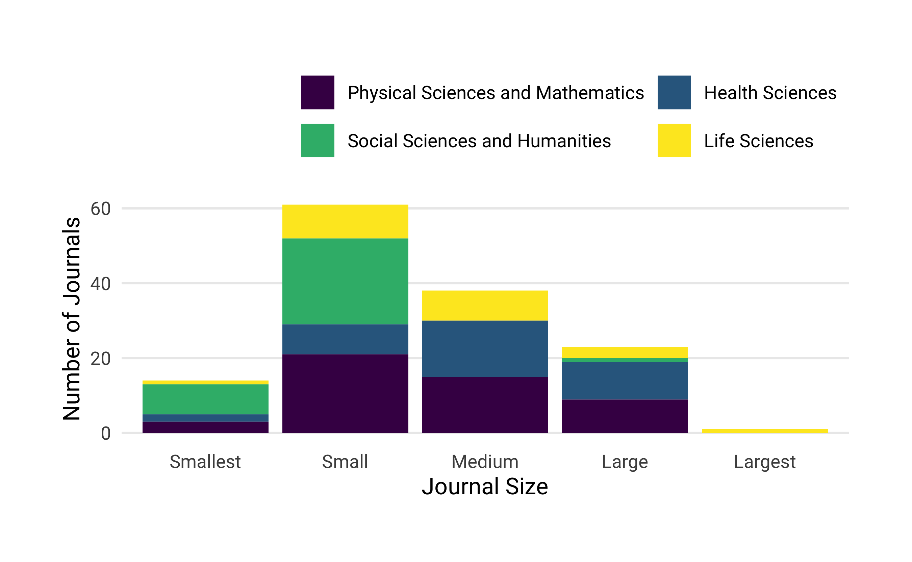
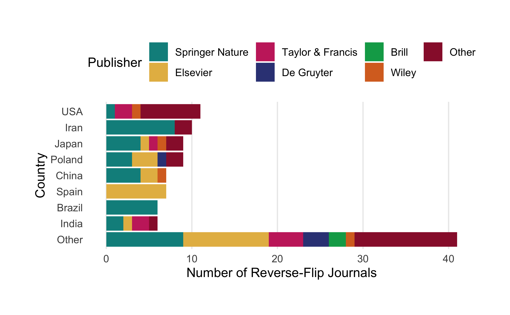
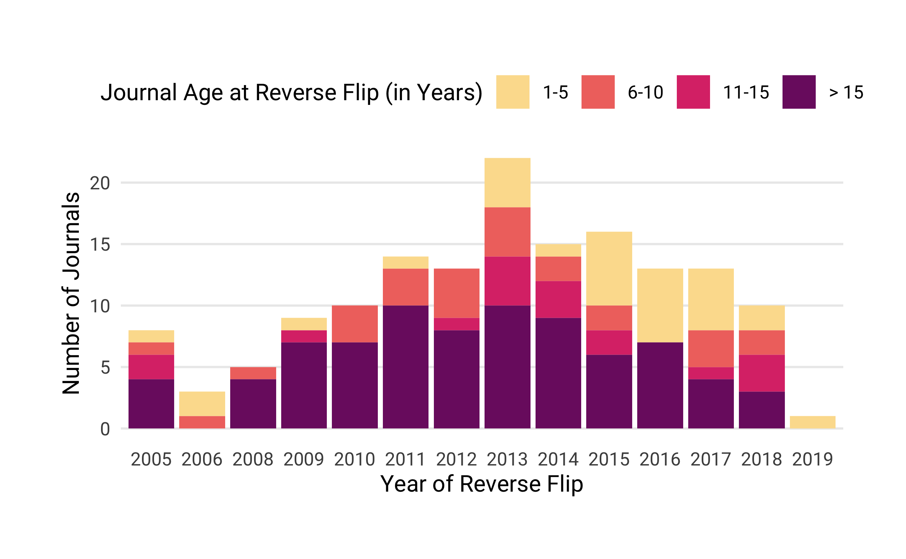
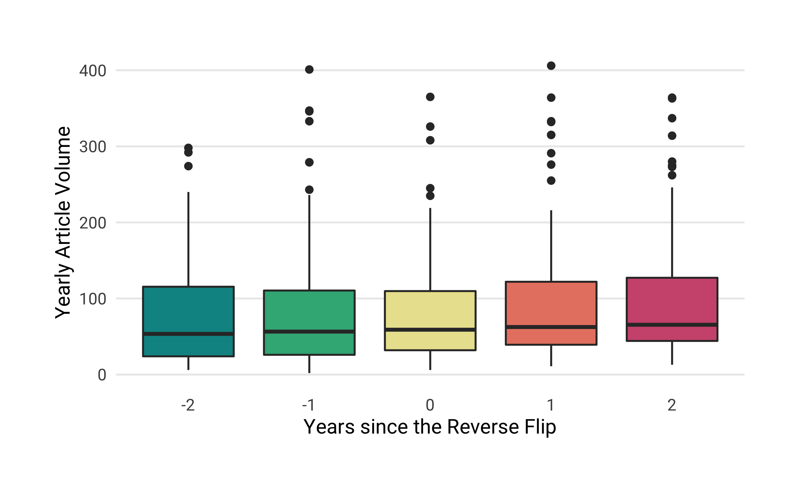
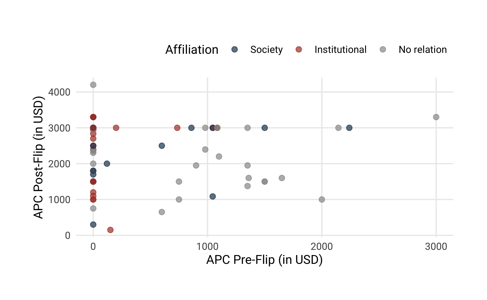

### Research Question 1: How many OA journals have reverse-flipped to a subscription model? 
 
We identified 152 journals that reverse-flipped from fully OA to a subscription model, including hybrid OA. While we discovered reverse-flips as early as 2005, the majority of journals changed their business model from 2013 onward (see Figure 3).

### Research Question 2: To provide a general overview,

#### a) How thoroughly are these journals currently indexed in major bibliometric databases (Web of Science, Scopus, PubMed)?
 

We investigated the coverage of reverse-flip journals in four major bibliometric databases -- Crossref, a large DOI registration agency for scholarly works, Scopus, Journal Citation Report (JCR) listing journals indexed in the Web of Science, and MEDLINE -- to examine how discoverable articles from these journals are. Using the most up-to-date  journal lists and search indexes available as of January 2019, we matched the journals’ ISSN variants, and found
that 147 journals were indexed by at least one these bibliometric databases, covering 97% of our sample. Figure visualizes the overlap and oversight of reverse-flip coverage between the different databases using the UpSet technique (<https://doi.org/10.1093/bioinformatics/btx364>). 
Of the 147 reverse-flip journals, Crossref and Scopus covered most. Together with the Web of Science (JCR) they shared the largest number of journals (N = 83), of which 26 journals were also indexed by MEDLINE.

#### b) How many articles did these journals publish between 2000 and 2018?

To obtain the journal publication volume, we retrieved the metadata for all articles indexed in Crossref from the year 2000 onwards. Specifically, Crossref provided the metadata for 137 out of 152 journals (90% of our sample). Our analysis shows that between 2000 and 2018, these journals published 190,951 articles, yet the annual article volume varies considerably between the journals (see Figure ), ranging from 10 - 638 with half of the journals publishing 56 or fewer articles per year. 

#### c) Which academic disciplines do the journals belong to?

Table presents a breakdown by top-level discipline, highlighting that reverse flipped journal were not limited to one field, but could be found across various disciplines.

Table: Breakdown of reverse flip journals by discipline

Discipline                           Reverse-flip Journals   Proportion (in %)
----------------------------------  ----------------------  ------------------
Physical Sciences and Mathematics                       52                  34
Health Sciences                                         39                  26
Social Sciences and Humanities                          38                  25
Life Sciences                                           23                  15
Total                                                  152                 100

<!-- -->

#### d) Under which publisher did the reverse flip occur? Who currently publishes the journals?

To investigate the extent of reverse flips across different publishers, we acquired the publisher names for every journal at the time of the reverse flip and that of the most current volume. Table x shows the top publishers -- post-flip and currently -- based on the number of journals that were converted from fully OA to subscription access. We found that around 70% of all reverse flips in our sample  (N=105 and N=104 respectively) can be attributed to six  publishers alone -- Elsevier, Springer Nature, Taylor & Francis, De Gruyter, Brill and Wiley. The remaining publishers are categorized as "Other". <!-- The distribution of reverse flips across publishers resembles the general conditions of the scholarly publishing market at-large, which is also dominated by large commercial publishers like Elsevier, Springer Nature, Taylor & Francis, and Wiley. -->

Publisher           OA Journals converted to Toll-Access   Proportion   Current number of reverse-flip journals   Proportion
-----------------  -------------------------------------  -----------  ----------------------------------------  -----------
Springer Nature                                       45         29.6                                        41         27.0
Elsevier                                              35         23.0                                        34         22.4
Taylor & Francis                                      12          7.9                                        14          9.2
De Gruyter                                             5          3.3                                         7          4.6
Brill                                                  4          2.6                                         4          2.6
Wiley                                                  4          2.6                                         4          2.6
Other                                                 47         30.9                                        48         31.6
Total                                                152        100.0                                       152        100.0

#### e) How many journals have been associated with scholarly societies or research institutions?  In which countries are these societies and institutions based?

We also collected information about whether reverse-flipped journals were related to scholarly societies or research institutions. We obtained 107 (70 %) reverse-flip journals that were affiliated with a scholarly society (N = 58) or research institution (N = 49). 

visualizes the relationships of journals to scholarly societies and research organizations by publishe

Figure visualizes the relationships of journals to scholarly societies and research organizations by publisher showing that the majority of reverse-flip journals from major publishers were not in-house venues, but journals affiliated with scholarly associations and other research organizations.

Figure presents the countries where the scholarly societies and research organizations are located by publisher.

<!-- -->

#### f) How old were the journals at the time of the reverse flip?

Table provides summary statistics about the journal age at the year of the reverse flip, revealing Large age differences that range from 1-124 years of publishing. Around 43% (N = 66) of all reverse-flip launched before 1990. These findings suggest that not all journals in our sample were born OA or online journals, but, in fact, some venues might have undergone more than one business model change in their publishing history.

Table: Summary statistics for journal age at time of reverse flip

                      Journal Age in Years
-------------------  ---------------------
Mean                                    25
Median                                  16
Standard Deviation                      22
Minimum                                  1
Maximum                                124
Q1                                       7
Q3                                      39

Figure presents the annual distribution of journals that converted from fully OA to a subscription-based business model grouped by journal age at the time of the flip

Figure presents a breakdown of discipline by journal age at the time of the reverse flip, shown as proportion of the total number of reverse flip journals in the dataset. The colored areas represent the distribution of journals per discipline. 

It seems that for health and life sciences journals (Health) the majority of flips only happened after a period of establishing the journal (>15 years). However, for the physical sciences and mathematics (PSM) as well as the social sciences and humanities (SSH) this process of reconsidering the publishing model seems to have started earlier. For PSM journals about one third already flipped within the first five years of the journal’s lifetime. <!-- Overall, this may have resulted from a somewhat lower degree of acceptance of APC-based open access in these disciplines (add REF)-->

### Research Question 3: Before the reverse flip, 

#### a) How many journals had been subscription venues before converting to OA?

We manually checked the past business models of every journal in our sample. As the journal age suggests, not all journals were born fully open access journals, but underwent several business model changes before the reverse flip. In fact, around 62% (N = 95) were subscription-based in the past before converting to fully open access. 

#### b) How many journals were APC-based, and at what price levels?

We investigated whether journals charged authors a publication fee using journal list prices. We were able to obtain information about APC pricing for 105 journals, representing 69 % of all reverse-flipped journals studied. Of these, 32 were APC-based. List prices varied considerably, ranging from 120 to 3,000 USD. The median fee was 1,066 USD.

### Research Question 4: After the reverse flip,

#### a) Which access model do the journals operate on?

Table presents the journals' access model after the reverse flip. Our analysis shows that around 50 % (N = 76) of the journals shifted to a hybrid OA model, while the remaining 50 % (N = 76) transformed to subscription venues. However, more than half (N=45) of the subscription journals eventually shifted to hybrid OA (e.g., all Taylor and Francis journals, 12 out of 13 Springer Nature journals, and 8 out of 20 Elsevier journals), and only one journal, the Journal of Language Contact: Evolution of Languages, Contact and Discourse published by Brill, flipped to OA again.

Table: Access model of journals after reverse flip

Access model    Journals   Proportion
-------------  ---------  -----------
Hybrid                76           50
Subscription          76           50
Total                152          100

#### b) Does the publication volume change?

To determine the variation in publication volume, we studied all journals that had reverse-flipped until 2016 for which Crossref provided article metadata two years before and after the conversion (N = 94).  For the most part, the article volumes two years before and after the flip reveal little change (see Figure X), yet some individual cases show a noticeable increase. Elsevier's Meta Gene, for example, launched as an OA journal with 16 published articles in 2013; the journal flipped to a hybrid model in 2016, publishing 86 articles that year, and increased its article volume to 201 in 2018.

There are, however, some cases were article volume increased noticeably. One example is the journal *Meta Gene* launched by Elsevier BV in 2013. Its article volume grew from 86 articles published in the year of the reverse flip (2016) to 201 articles published two years after (2018).

#### c) Do journal-level citation metrics change?

To investigate whether the citation impact changed after the access model conversion, we used the Source Normalized Impact per Paper (SNIP) indicator from the Centre for Science and Technology Studies (CWTS), matching 117 of 152 journals from our sample.
The most recent SNIP values were reported for 2017; accordingly, we only included journals that flipped until 2015 (N = 82).
Figure illustrates the SNIP distribution of reverse-flip journals two years before and after the conversion. Our analysis highlights that there is only little change in SNIP values before and after the business model change.

### Research Question 5: For hybrid journals—OA journals that have flipped to hybrid OA directly as well as OA journals that first became subscription venues and then, at a later point, incorporated hybrid OA—,

#### a) How do APC levels differ before and after the flip?

We were able to obtain publication fee list prices before and after the flip including the most recent level in 2018. While  32 fully open access journals charged author fees before the reverse-flip, 118 journals offered paid hybrid open access options at the time of analysis. Figure compares APC list prices in USD with each other, highlighting an considerable increase after the reverse flip. It also shows that many journals affiliated with scholarly societies and research institutions introduced or raised their APCs for open access publishing.

#### b) What is the uptake of hybrid OA articles; Was OA publishing in reverse-flip journals enabled by transformative agreements?

Retrieving open content licenses including start date from Crossref, we were able to obtain 1,083 articles from 25 reverse flip journals that were made available immediately as open access articles in the year or after the reverse flip. They represent 8.7% of the total article volume of these journals after the reverse-flip (N = 12,517).

Using data from the Open APC initiative, we then checked whether academic institutions had financed hybrid OA articles in reverse-flip journals. We found evidence for institutional sponsorship for three articles in these journals, and as part of the transformative agreement “Springer Compact" between Springer Nature and individual institutions and countries. Table summarizes the total number of articles in reverse-flip journals that were made openly available through “Springer Compact” as well as its proportion per transformation contract. Although the proportion of these articles is marginal, our findings suggest that control mechanisms that help institutions to prevent funding of OA publications in reverse-flipped journals are not in place.

Sponsor           OA Articles in Reverse Flip Journals   All OA Articles   Proportion (in%)
---------------  -------------------------------------  ----------------  -----------------
United Kingdom                                      22             10289               0.21
Sweden                                              10              3285               0.30
Austria                                              5              1721               0.29
Germany                                              3               621               0.48
Netherlands                                          2              6085               0.03

#### c) How long are the embargo periods?

We were able to find the embargo periods for 112) out of 154 reverse-flip journals that currently offer a hybrid OA option. The majority of the journals (N=73) does not allow authors to share their work openly, for example by depositing a copy of the manuscript in an OA repository, until 12 months after it has been published. However, 14% of the journals (N=16) raise the bar to 24 months, while 12% (N=13) do not impose any embargo periods (Figure).

<!-- -->

