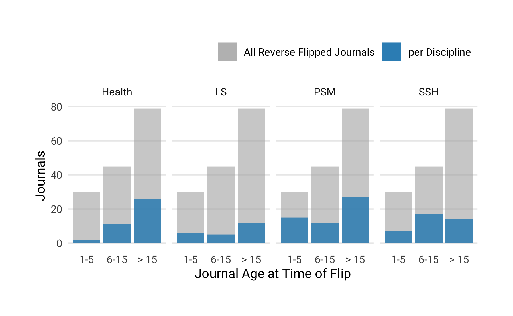
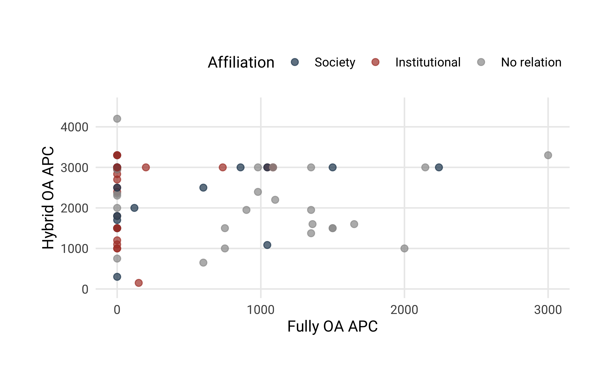

### Research question 1: How many journals reverse-flipped from fully open access to toll-access (including hybrid)? 

We found 159 journals that converted from fully open access to a subscription-based business model including hybrid open access. Figure presents a breakdown of these journals by the year when this switch occurred. While the earliest reverse flip happened in 2004, the majority of journals changed their business model from 2013 onward (N = 96).

### Research Question 2: How many articles did these journals publish between 2000 and 2018?

To obtain the journal publication volume, we retrieved all articles indexed in Crossref from 2000 onward. Articles metadata from 142 journals were registered with Crossref, representing 89% of our sample. These converted journals published 214,570 articles between 2000 and 2018. Table presents summary statistics for the average yearly publication volume. It reveals that the size of the journals in terms of the yearly article volume varies considerably, ranging from 10 to 2,192. Half of the journals studied published 58 or less articles per year. 

Table: Summary statistics of yearly average publication volume per reverse flip journals. Publication volume for 142 journals was obtained using Crossref.

                      Average Yearly Article Volume
-------------------  ------------------------------
Mean                                            113
Median                                           58
Standard Deviation                              209
Minimum                                          10
Maximum                                        2192
Q1                                               30
Q3                                              113

### Research Question 3: What is the disciplinary distribution of these journals? 

Table presents a breakdown by top-level discipline, highlighting that reverse flipped journal could be found in various fields (needs to be discussed).

Table: Breakdown of reverse flip journals by discipline

Discipline    Number of Journals   Proportion (in%)
-----------  -------------------  -----------------
Health                        41               25.8
LS                            24               15.1
Mult                           2                1.3
PSM                           54               34.0
SSH                           38               23.9
Total                        159              100.0

### Research Question 4: How old were the journals when the reverse flips happened?

Table provides summary statistics about the journal age at the year of the reverse flip. Large age differences can be observed, ranging from one year of existences to 124 years. Around 42% (N = 66) of all journals found started before 1990 These findings suggest that not all journals in our sample were born fully open access or online journals, but some might underwent more than one business model change in the course of history.

Table: Summary statistics for journal age at time of reverse flip

                      Journal Age in Years
-------------------  ---------------------
Mean                                    24
Median                                  16
Standard Deviation                      22
Minimum                                  1
Maximum                                124
Q1                                       6
Q3                                      36

Figure provides a breakdown of discipline by journal age at the time of the reverse flip, shown as proportion of the total number of reverse flip journals in the dataset. The colored areas represent the distribution of journals per discipline. 

### Research Question 5: What publishers are now publishing the reverse-flipped journals?

To investigate the extent of reverse flips across publishers, publisher names for every journal were obtained using Crossref, and if not available, added manually. In case of a change of publishing house, which is the case for over 72% (N = 115) journals in our sample , the current publisher name was used. In total, 46 different publishing houses with reversely flipped journals are included in our dataset. 

Table shows the top 5 publishers based on the number of journals in their subscription-based portfolio that were converted from fully open access. These five publishers comprise a total 103 journals, representing 65% of all journals found. The remaining 41 publishers are represented in the category "Other". The extent of reverse flips across publishers reflects roughly the general market shares in scholarly publishing  where the large commercial publishers Elsevier BV, Springer Nature, Informa UK Limited and Wiley also dominate.

Table: Top 5 publishers based on number of journals converted from from fully open access to a subscription-based business model

Publisher                 Reversely flipped journals   Proportion (in%)
-----------------------  ---------------------------  -----------------
Springer Nature                                   41               25.8
Elsevier BV                                       37               23.3
Informa UK Limited                                13                8.2
Walter de Gruyter GmbH                             7                4.4
Wiley                                              5                3.1
Other                                             56               35.2
Total                                            159              100.0

### Research Question 6: How many of these journals a) had been subscription journals in the past, b) had been APC-based prior to the reverse-flip, and at what price levels, c) are associated with scholarly societies?

(unsure about how to answer this question using our dataset, help is very much appreciated!)

### Research Question 7:  Is there significant variation in  a) publication volume before and after the reverse flip and b) journal-level citation metrics before and after the reverse flip?

To determine the variation in publication volume, we studied all journals in our dataset that converted latest in 2016 and where Crossref provided article metadata two years before and after the year of the reverse flip. Publication volume for this five-years period could be obtained for 94 journals.

Comparing yearly article volumes two years before and two years after the flip reveals little change. The median article volume  increased marginally from 53 to 60 articles. Figure illustrate the distribution before and after the flip.

To investigate whether the citation impact of a journal changed after the journal was converted to a toll-access business model, we used the source normalized impact per paper (SNIP) indicator from the CWTS. We were able to match 123 journals. Figure illustrates the SNIP distribution of reverse-flip-journals two years before and after the conversion. The latest SNIP values were reported for 2017. Accordingly, only journals where the flip happened in 2015 or earlier were taken into account (N = 82).

Figure suggests that there is no statistical difference on SNIP values before and after the business model change. 

### Research Question 8: For the subset of journals that now offer hybrid OA, a) what is the difference in the APC before and after the flip among the journals, b) what is the uptake of hybrid OA in these journals, is it above average among hybrid OA journals? 

Table presents the journal business model after the reverse flip. It highlights that around 51 % of the journals offer options to make articles immediately availabe after a fee was paid, also know as hybrid open access. 74  or 47 % journals operated under a subscription-based model only.

Table: Business model of journals after reverse flip

Business model             Journals   Proportion
------------------------  ---------  -----------
Hybrid                           80        50.31
Subscription                     73        45.91
Delayed OA                        2         1.26
NA                                2         1.26
Delayed OA/Hybrid                 1         0.63
Delayed OA/Subscription           1         0.63
Total                           159       100.00

We were able to obtain publication fee list prices before and after the flip for 27 journals. Figure compares them with each other, highlighting an considerable increase after the reverse flip.  

<!-- -->
