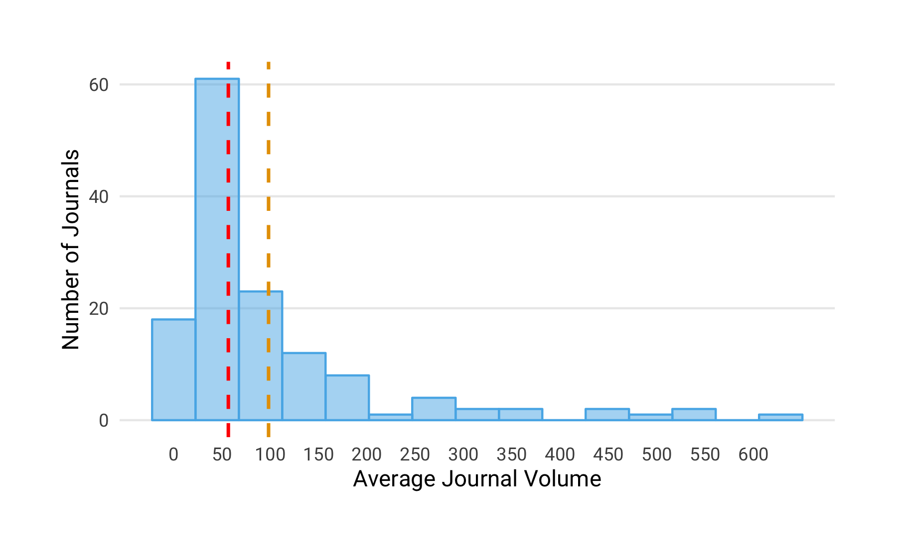

### Research Question 1: How many OA journals have reverse-flipped to a subscription model? 
 
We identified 152 journals that converted from fully open access to a subscription model, including hybrid open access. While we discovered reverse-flips as early as 2005, the majority of journals changed their business model from 2013 onward (see Figure 3).

### Research Question 2: To provide a general overview,

#### a) How thoroughly are these journals currently indexed in major bibliometric databases (Web of Science, Scopus, PubMed)?
 
We investigated the coverage of reverse-flip journals in the following four major bibliometric databases: Crossref, a large DOI registration agency for scholarly works, Scopus, Journal Citation Report (JCR) listing journals indexed in the Web of Science, and MEDLINE. This analysis is based at the journal-level by matching ISSN variants. We used the most current available journal lists and search indexes at the time of our analysis in January 2019. 

In total, we found 147 journals that were indexed by at least one bibliometric databases examined, covering 97% of the journals in our study. Figure presents the number of reverse-flip journals that were indexed by each database together with the intersections with the other databases using the UpSet technique (<https://doi.org/10.1093/bioinformatics/btx364>). 
Of the 147 reverse-flip journals, Crossref and Scopus covered most. Together with the Web of Science (JCR) they shared the largest number of journals (N = 83), of which 26 journals were also indexed by MEDLINE.

<!-- -->

#### b) How many articles did these journals publish between 2000 and 2018?

To obtain the journal publication volume, we retrieved the metadata for all articles indexed in Crossref from the year 2000 onwards. Specifically, Crossref provided the metadata for 137 out of 152 journals (90% of our sample). Our analysis shows that between 2000 and 2018, these journals published 190,951 articles, yet the yearly article volume varies considerably (see Figure 4), ranging from 10 to 638 with half of the journals publishing 56 or fewer articles per year. 

#### c) To which academic disciplines do the journals belong to?

Table presents a breakdown by top-level discipline, highlighting that reverse flipped journal were not limited to one field, but could be found across various disciplines.

Table: Breakdown of reverse flip journals by discipline

Discipline    Reverse-flip Journals   Proportion (in %)
-----------  ----------------------  ------------------
PSM                              52                  34
Health                           39                  26
SSH                              38                  25
LS                               23                  15
Total                           152                 100

#### d) Under which publisher did the reverse-flip occur? Who does currently publish the journals?

To investigate the extent of reverse flips across different publishers, we acquired the publisher names for every journal at the time of the reverse flip and that of the most current volume. Table x shows the post-flip and current top  publishers based on the number of journals that were converted from fully OA to subscription access. These six publishers - Elsevier, Springer Nature, Taylor & Francis, De Gruyter, Brill and Wiley - comprised 105 journals at the time of the reverse-flip and 104 at the time of the most recent volume, representing around 70% of all reverse-flips journals investigated. The remaining publishers are categorized as "Other". The distribution of reverse flips across publishers resembles the general conditions of the scholarly publishing market at-large, which is also dominated by large commercial publishers like Elsevier, Springer Nature, Taylor and Francis, and Wiley.

Publisher           OA Journals converted to Toll-Access   Proportion   Current number of reversely-flipped journals   Proportion
-----------------  -------------------------------------  -----------  ---------------------------------------------  -----------
Springer Nature                                       45         29.6                                             41         27.0
Elsevier                                              35         23.0                                             34         22.4
Taylor & Francis                                      12          7.9                                             14          9.2
De Gruyter                                             5          3.3                                              7          4.6
Brill                                                  4          2.6                                              4          2.6
Wiley                                                  4          2.6                                              4          2.6
Other                                                 47         30.9                                             48         31.6
Total                                                152        100.0                                            152        100.0

#### e) How many journals have been associated with scholarly societies or academic institutions?

Our dataset contains information about whether reverse-flipped journals were related to scholarly societies and academic institutions. We obtained 107 (70 %) reverse-flip journals that were either published together with a scholarly society (N = 59) or at an academic institution (N = 48). 

Figure presents the extent to which journals were related to scholarly societies or academic institutions at the time of the reverse-flip. It shows that the majority of reverse-flip journals from major publishers were affiliated with professional associations and other research organisations.

<!-- -->

#### f) How old were the journals at the time of the reverse flip?

Table provides summary statistics about the journal age at the year of the reverse flip. Large age differences can be observed, ranging from one year of existences to 124 years. Around 43% (N = 66) of all journals found started before 1990. These findings suggest that not all journals in our sample were born fully open access or online journals, but some might underwent more than one business model change in the course of history.

Table: Summary statistics for journal age at time of reverse flip

                      Journal Age in Years
-------------------  ---------------------
Mean                                    25
Median                                  16
Standard Deviation                      22
Minimum                                  1
Maximum                                124
Q1                                       7
Q3                                      39

Figure presents the number of journals converted from fully open access to a subscription-based business model per year grouped by journal age when the reverse flip happened.

Figure presents a breakdown of discipline by journal age at the time of the reverse flip, shown as proportion of the total number of reverse flip journals in the dataset. The colored areas represent the distribution of journals per discipline. 

It seems that for health and life sciences journals (Health) the majority of flips only happened after a period of establishing the journal (>15 years). However, for the physical sciences and mathematics (PSM) as well as the social sciences and humanities (SSH) this process of reconsidering the publishing model seems to have started earlier. For PSM journals about one third already flipped within the first five years of the journal’s lifetime. <!-- Overall, this may have resulted from a somewhat lower degree of acceptance of APC-based open access in these disciplines (add REF)-->

### Research Question 3: Before the reverse flip, 

#### a) How many journals had been subscription venues before converting to OA?

We manually checked the past business models of every journal in our sample. As the journal age suggests, not all journals were born fully open access journals, but underwent several business model changes before the reverse flip. In fact, around 62% (N = 95) were subscription-based in the past before converting to fully open access. 

#### b) How many journals were APC-based, and at what price levels?

We investigated whether journals charged authors a publication fee using journal list prices. We were able to obtain information about APC pricing for 105 journals, representing 69 % of all reverse-flipped journals studied. Of these, 32 were APC-based. List prices varied considerably, ranging from 120 to 3,000 USD. The median fee was 1,066 USD.

#### c) Which countries were the journals based in? 

### Research Question 4: After the reverse flip,

#### a) Which access model do the journals operate on?

Table presents the journals' access model after the reverse-flip. Our analysis shows that around 50 % (N = 76) of the journals shifted to a hybrid OA model, while the remaining 50 % (N = 76) transformed to subscription venues. 

offer options to make articles immediately available after a fee was paid, also known as hybrid open access. 76  or 50 % (N = 76) journals operated under a subscription-based model only.

Table: Business model of journals after reverse flip

Business model    Journals   Proportion
---------------  ---------  -----------
Hybrid                  76           50
Subscription            76           50
Total                  152          100

#### b) Does the publication volume change?

To determine the variation in publication volume, we studied all journals that had reverse-flipped until 2016 for which Crossref provided article metadata two years before and after the conversion (N = 94).  For the most part, the article volumes two years before and after the flip reveal little change (see Figure X), yet some individual cases show a noticeable increase. Elsevier's Meta Gene, for example, launched as an OA journal with 16 published articles in 2013; the journal flipped to a hybrid model in 2016, publishing 86 articles that year, and increased its article volume to 201 in 2018.

There are, however, some cases were article volume increased noticeably. One example is the journal *Meta Gene* launched by Elsevier BV in 2013. Its article volume grew from 86 articles published in the year of the reverse flip (2016) to 201 articles published two years after (2018).

#### c) Do journal-level citation metrics change?

To investigate whether the citation impact changed after the access model conversion, we used the Source Normalized Impact per Paper (SNIP) indicator from the Centre for Science and Technology Studies (CWTS), matching 117 of 152 journals from our sample.
The most recent SNIP values were reported for 2017; accordingly, we only included journals that flipped until 2015 (N = 82).
Figure illustrates the SNIP distribution of reverse-flip journals two years before and after the conversion. Our analysis highlights that there is only little change in SNIP values before and after the business model change.

